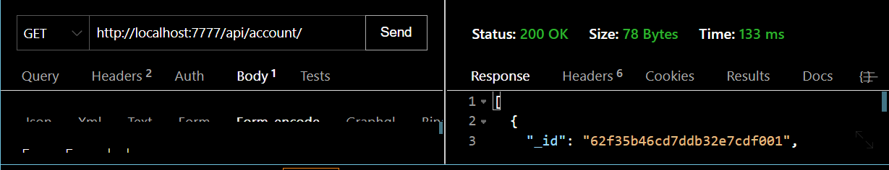
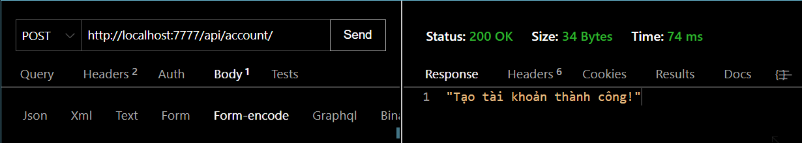
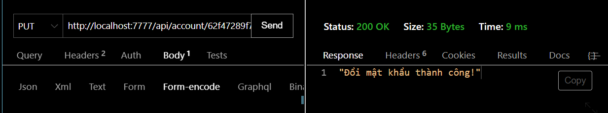
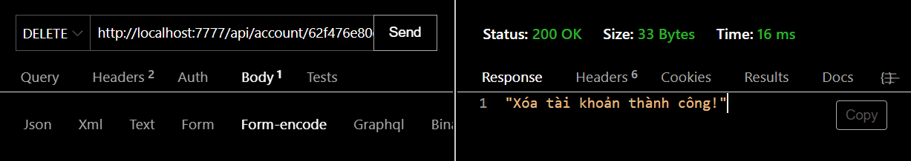
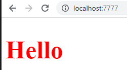
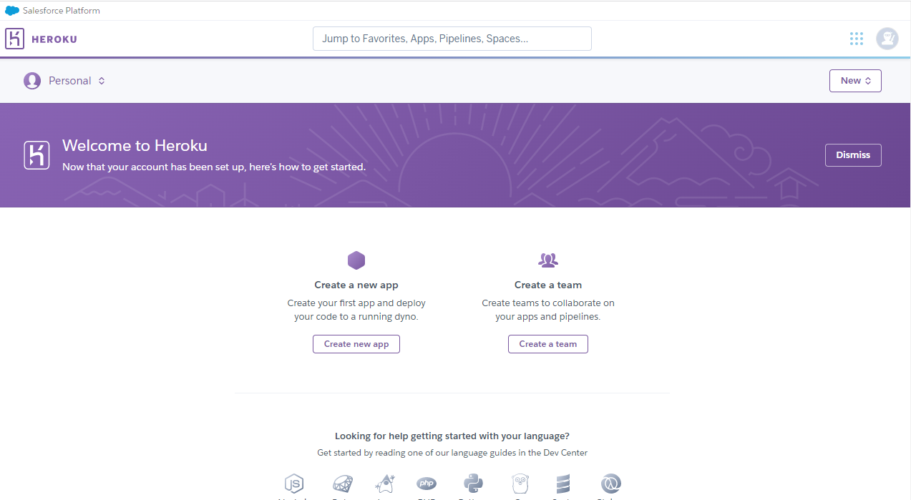
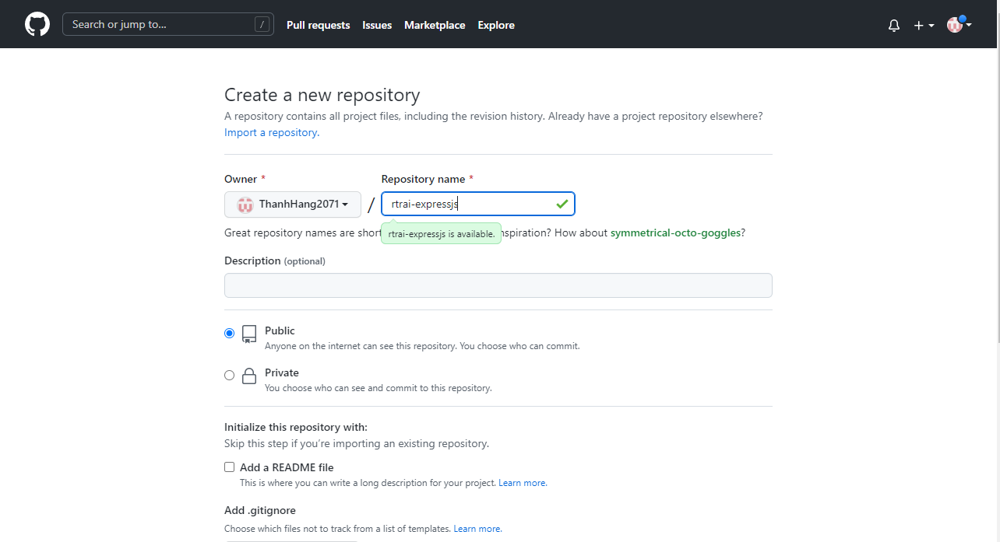
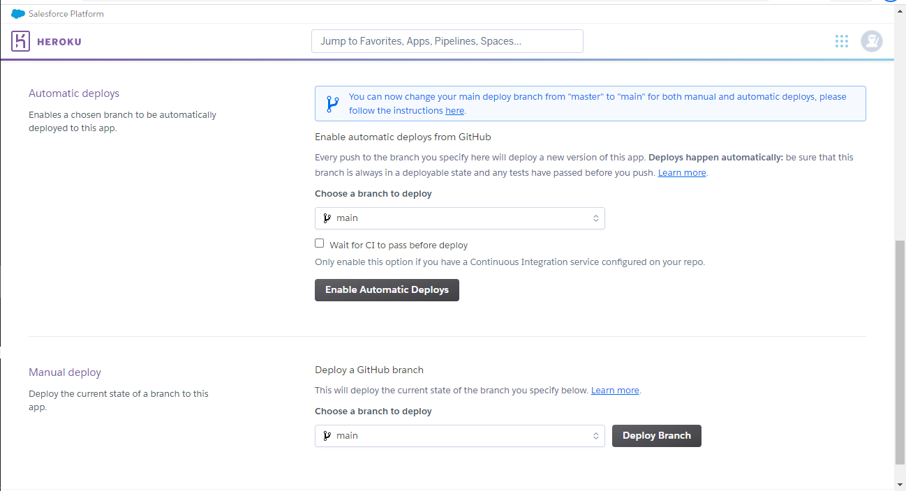

1. [TỔNG QUAN FRAMEWORK EXPRESSJS NODEJS](#tổng-quan-framework-expressjs-nodejs)
2. [KHỞI TẠO DỰ ÁN](#khởi-tạo-dự-án)
3. [CÁCH SỬ DỤNG ROUTER TRONG EXPRESSJS](#cách-sử-dụng-router-trong-expressjs)
4. [MIDDLEWARE](#middleware)
5. [SỬ DỤNG CÁC METHOD GET, POST, PUT, DELETE CHUẨN RESTFUL API](#sử-dụng-các-method-get-post-put-delete-chuẩn-restful-api)
6. [TRIỂN KHAI CHỨC NĂNG ĐĂNG KÝ, ĐĂNG NHẬP](#triển-khai-chức-năng-đăng-ký-đăng-nhập)
7. [TÌM HIỂU CHUẨN RESTFUL API](#tìm-hiểu-chuẩn-restful-api)
8. [EXPRESS STATIC , THIẾT LẬP FILE TĨNH, PUBLIC FILE TRONG EXPRESSJS](#express-static--thiết-lập-file-tĩnh-public-file-trong-expressjs)
9. [HƯỚNG DẪN ĐẨY CODE EXPRESSJS NODEJS LÊN HEROKU - DELOY SERVER HEROKU](#hướng-dẫn-đẩy-code-expressjs-nodejs-lên-heroku---deloy-server-heroku)
10. [PHÂN TRANG API, PAGINATION API](#phân-trang-api-pagination-api)
11. [LUYỆN TẬP PHÂN TRANG PAGINATION API DƯỚI CLIENT](#luyện-tập-phân-trang-pagination-api-dưới-client)

# TỔNG QUAN FRAMEWORK EXPRESSJS NODEJS

Express là một framework application web. Cung cấp các API

- Kiến thức cần chuẩn bị trước :
  - Có nền tảng JS chắc chắn 
  - Biết áp dụng bất đồng bộ trong JS
  - Đã tìm hiểu về nodejs và các builtin cơ bản : FS, Path, ...
  - Biết sử dụng npm các package
  - Biết Database cơ bản 


# KHỞI TẠO DỰ ÁN 

- Sử dụng lệnh sau để tạo file `package.json` :
``` 
$ npm init -y
```
- Cài đặt `express` :
``` 
$ npm i express
```
- Cài đặt `nodemon` :
``` 
$ npm i nodemon -save--dev
```
- Đoạn code mẫu trong file `index.js`
``` javascript
const express = require('express')
const app = express()
const port = 3000

app.get('/', (req, res) => {
  res.send('Hello World!')
})

app.listen(port, () => {
  console.log(`App listening at http://localhost:${port}`)
})
```
*Note* : Đặt `port` nên đặt trên 1000

- Trong file `package.json` với `"scripts"` tạo thêm start để mỗi lần ở terminal chỉ cần lệnh `npm start` là có thể chạy khởi tạo server và cập nhập liên tục
``` json
 "scripts": {
    "start" : "nodemon index.js",
    "test": "echo \"Error: no test specified\" && exit 1"
  },
```

# CÁCH SỬ DỤNG ROUTER TRONG EXPRESSJS

- **Routers** : Người quản lý đường dẫn, nhóm lại các đường dẫn
- **`index.js`** : 
``` javascript
const express = require('express')
const router1 = express.Router()
const router2 = express.Router()
const port = 7777
const app = express()

router1.get("/", (req, res) => {
    res.json('Router 1 user')
})

app.get('/', (req, res) => {
  res.json('Home')
})

app.use("/api1/", router1)
// localhost:7777/api1/

app.listen(port, () => {
  console.log(`App listening at http://localhost:${port}`)
})
```
Để quản lý các đường dẫn có chung tiền tố, tạo một file dạng _Router.js để các đường dẫn ấy vào, ví dụ có chung tiền tố `/api1/`, tạo 1 file `apiRouter.js`

`apiRouter.js` :
```javascript
const express = require('express')
const router = express.Router()

router.get("/", (req, res) => {
    res.json('Router 1 user')
})

router.get("/product", (req, res) => {
    res.json('Router 1 product')
})

router.get("/cart", (req, res) => {
    res.json('Router 1 user')
})

module.exports = router
```
Còn file `index.js` thành : 
``` javascript
const express = require('express')
const router1 = require('./apiRouter')
const port = 7777
const app = express()

app.use("/api/", router)
// localhost:7777/api/

app.listen(port, () => {
  console.log(`App listening at http://localhost:${port}`)
})
```

# MIDDLEWARE

- **Middleware** : dùng để ngăn chặn quyền truy cập 

# SỬ DỤNG CÁC METHOD GET, POST, PUT, DELETE CHUẨN RESTFUL API

- Truy xuất đường dẫn trên trang web mặc định là GET 
- Khi POST các dữ liệu lên cần đổi các dữ liệu đấy vào request, sử dụng thư viện `body-parser`
```
$ npm i body-parser
```
Require thư viện trong `index.js` :
```javascript
const bodyParser = require('body-parser')

// parse application/x-www-form-urlencoded
app.use(bodyParser.urlencoded({ extended: false }))

// parse application/json
app.use(bodyParser.json())
```
- Muốn đọc request body với headers thì dùng lệnh :
``` javascript
req.headers
req.body
```

# TRIỂN KHAI CHỨC NĂNG ĐĂNG KÝ, ĐĂNG NHẬP 

- Cài đặt `mongoose` :
```
$ npm i mongoose
```
- Tạo folder `models` để chứa các model
- Trong models tạo một file `account.js` để tạo Schema cho các data lưu vào MongoDB
- **`account.js`** :
``` javascript
const mongoose = require('mongoose')
mongoose.connect('mongodb://localhost/ExpressJS')

const Schema = mongoose.Schema

const AccountSchema = new Schema({
  username : {
    type : String,
    require : true
  }, 
  password : {
    type : String,
    require : true
  }
}, {
    collection : 'account'
})

const AccountModel = mongoose.model("account", AccountSchema)
module.exports = AccountModel
```
- Require AccountModel trong `index.js` và chỉnh lại phần POST :
```javascript
const AccountModel = require('./models/account')

app.post("/register", (req, res, next) => {
  var username = req.body.username
  var password = req.body.password
  console.log(username, password)
  // res.json("username, password")
  AccountModel.create({
    username: username,
    password: password
  })
  .then(data => {
    res.json('Tạo tài khoản thành công')
  })
  .catch(err => {
    res.status(500).json('Tạo tài khoản thất bại')
  })
})
```
- (`index.js`) Để không bị trùng username với nhau, đổi đoạn post thành :
``` javascript
app.post("/register", (req, res, next) => {
  var username = req.body.username
  var password = req.body.password
  console.log(username, password)
  // res.json("username, password")

  AccountModel.findOne({
    username: username
  })
  .then(data => {
    if (data) {
      res.json('Tài khoản đã tồn tại ')
    }
    else {
      return AccountModel.create({
        username: username,
        password: password
      })
    }
  })
  .then(data => {
    res.json('Tạo tài khoản thành công')
  })
  .catch(err => {
    res.status(500).json('Tạo tài khoản thất bại')
  })
})
```
- Tạo chức năng login, trong file `index.js` thêm đoạn code sau :
```javascript
app.post('/login', (req, res, next) => {
  var username = req.body.username
  var password = req.body.password
  AccountModel.findOne({
    username : username,
    password : password
  })
  .then(data => {
    if(data) {
      res.json("Đăng nhập thành công")
    }
    else {
      res.status(400).json("Username hoặc Password không đúng!")
    }

  })
  .catch(err => {
    res.status(500).json("Đăng nhập thất bại có lỗi bên server")
  })
})
```
- Sử dụng `Thunder Client` (extension VS code) hoặc `Postman` để test API :


# TÌM HIỂU CHUẨN RESTFUL API 

- Tạo folder `routers`, sau đó tạo file `account.js` 
- **`routers/account.js`** thêm đoạn sau để lấy dữ liệu các tài khoản đã tạo có trong DB :
```javascript
const express = require('express')
const router =  express.Router()
const AccountModel = require('../models/account')

// Lấy dữ liệu từ DB
router.get('/', (req, res, next) => {
    AccountModel.find({})
    .then(data => {
        res.json(data)
    })
    .catch(err => {
        res.status(500).json("Lỗi server")
    })
})

// Thêm mới dữ liệu từ DB
router.post('/', (req, res, next) => {
    AccountModel.create({})
    .then(data => {
        res.json(data)
    })
    .catch(err => {
        res.status(500).json("Lỗi server")
    })
})
```
- Thử API trong Thunder Client :
<div align='center'>

</div>

- **`routers/account.js`** Thêm tiếp đoạn sau để tạo tài khoản :
``` javascript
// Thêm mới dữ liệu từ DB
router.post('/', (req, res, next) => {
    var username = req.body.username
    var password = req.body.password
    AccountModel.create({
        username : username,
        password : password
    })
    .then(data => {
        res.json("Tạo tài khoản thành công!")
    })
    .catch(err => {
        res.status(500).json("Lỗi server")
    })
})
```
- Tiếp tục thử trong Thunder Client :

<div align='center'>

</div>

Kiểm tra trong MongoDB hoặc sử dụng method GET để xem dữ liệu đã được thêm chưa

- **`routers/account.js`** Thêm tiếp đoạn sau để update tài khoản (đổi password) :

``` javascript
// Update dữ liệu trong DB
router.put('/:id', (req, res, next) => {
    var id = req.params.id
    var newPassword = req.body.password
    AccountModel.findByIdAndUpdate(id, {
        password : newPassword 
    })
    .then(data => {
        res.json("Đổi mật khẩu thành công!")
    })
    .catch(err => {
        res.status(500).json("Lỗi server")
    })
})
```
- Tiếp tục thử trong Thunder Client, lấy id một tài khoản đã tạo để vào trong đường link :

<div align='center'>

</div>

- **`routers/account.js`** Thêm tiếp đoạn sau để xóa tài khoản trong DB :

``` javascript
// Xóa dữ liệu trong DB
router.delete('/:id', (req, res, next) => {
    var id = req.params.id
    AccountModel.deleteOne({
        _id : id
    })
    .then(data => {
        res.json("Xóa tài khoản thành công!")
    })
    .catch(err => {
        res.status(500).json("Lỗi server")
    })
})
```
- Tiếp tục thử trong Thunder Client, lấy id một tài khoản đã tạo để vào trong đường link :

<div align='center'>

</div>

- **`routers/account.js`** Để xem thông tin của một tài khoản, thêm đoạn code sau : 
``` javascript
router.get('/:id', (req, res, next) => {
    var id = req.params.id
    AccountModel.findById(id)
    .then(data => {
        res.json(data)
    })
    .catch(err => {
        res.status(500).json("Lỗi server")
    })
})
```

# EXPRESS STATIC , THIẾT LẬP FILE TĨNH, PUBLIC FILE TRONG EXPRESSJS

-Tạo một folder `public`, tạo file `server.js` thêm đoạn code sau :
```javascript
const express = require('express')
const path  = require('path') 

const app = express()
const port = 7777

app.use("/public" ,express.static(path.join(__dirname, '/public')))

app.get("/", (req, res) => {
    var duongDanFile = path.join(__dirname, 'home.html')
    res.sendFile(duongDanFile)
})


app.listen(port, () => {
    console.log(`App listening at http://localhost:${port}`)
  })
```
- Tạo file `home.html` :
```html
<!DOCTYPE html>
<html lang="en">
<head>
    <meta charset="UTF-8">
    <meta http-equiv="X-UA-Compatible" content="IE=edge">
    <meta name="viewport" content="width=device-width, initial-scale=1.0">
    <title>Document</title>
    <link rel="stylesheet" href="./public/home.css">
</head>
<body>
    <h1>Hello</h1>
</body>
</html>
```
- Tạo file `home.css` trong `public`:
```css
h1{
    color: red;
    font-size: 50px;
}
```
- Chạy `npm start` để khởi tạo server, nhớ đổi trong `package.json` từ `index.js` -> `server.js`, sau khi chạy được như hình :
<div align='center'>

</div>

# HƯỚNG DẪN ĐẨY CODE EXPRESSJS NODEJS LÊN HEROKU - DELOY SERVER HEROKU

- Truy cập <a href="https://www.heroku.com/">Heroku</a>
- Tạo tài khoản, chọn `Create a new app` để tạo app mới
<div align='center'>

</div>

- Vào `GitHub` tạo resposity mới và up dữ liệu lên GitHub theo hướng dẫn <a href="https://fullstack.edu.vn/blog/cach-dua-code-len-github-va-tao-github-pages.html">này</a>
<div align='center'>

</div>

- Chọn `Connect to GitHub`, chọn dự án đã up, kéo xuống chọn `Enable Automatic Deploys` 

<div align='center'>

</div>

- Kéo lên bấm vào `Open App` sẽ có giao diện, chờ khoảng vài phút 

- Mỗi lần sửa code xong cần up lên dùng lệnh trong terminal :
``` 
$ git add .
```
- Thêm commit :
```
$ git commit -m "..."
```
```
$ git push
```
- Chỉnh lại file server đoạn tạo port lắng nghe :
```javascript
app.listen(process.env.PORT, () => {
    console.log(`App listening`)
    // console.log(`App listening at http://localhost:${port}`)
  })
```

# PHÂN TRANG API, PAGINATION API 

- Tăng trải nghiệm người dùng tốt hơn với phân trang, mỗi lần lướt xuống hoặc qua trang sẽ load khối phần tử trong dữ liệu đó 
- Xem giải thích ở clip <a href="https://www.youtube.com/watch?v=s5DmOa10aG8&list=PLodO7Gi1F7R1GMefX_44suLAaXnaNYMyC&index=10">này</a>
- Tạo file `User.js` trong folder `models` :
- **`User.js`** :
```javascript
const mongoose = require('mongoose')
mongoose.connect('mongodb://localhost/ExpressJS')

const Schema = mongoose.Schema

const AccountSchema = new Schema({
  username : {
    type : String,
    require : true
  }, 
  password : {
    type : String,
    require : true
  }
}, {
    collection : 'account'
})

const AccountModel = mongoose.model("account", AccountSchema)

for (let i = 0; i < 20; i++) {
  AccountModel.create({
    username : "RTR_AI_" + i,
    password : 123456
  })
}

module.exports = AccountModel
```
*Vòng lặp for để tạo 20 acc với pass là "123456", sau đó xóa phần vòng lặp đó đi.*

- Lúc này `server.js` sẽ như thế này để xem all users, hoặc coi theo từng trang :
```javascript
const express = require('express')
const bodyParser = require('body-parser')
const path  = require('path') 

const AccountModel = require('./models/account')

const port = 7777
const app = express()

app.use("/public" ,express.static(path.join(__dirname, '/public')))

// parse application/x-www-form-urlencoded
app.use(bodyParser.urlencoded({ extended: false }))

// parse application/json
app.use(bodyParser.json())

const PAGE_SIZE = 2   // Số phần tử giới hạn

app.get('/user', (req, res, next) => {
  var page = req.query.page
  // http://localhost:7777/user?page=1
  if(page) {
    // get page
    page = parseInt(page)
    if (page < 1) {
      page = 1
    }
    var skip = (page - 1) * PAGE_SIZE // Số lượng bỏ qua
    AccountModel.find({})
    .skip(skip)
    .limit(PAGE_SIZE)   
    .then(data => {
      res.json(data)
    })
    .catch(err => {
      res.status(500).json("Có lỗi bên server")
    })
  }
  else {
    // get all
    AccountModel.find({})
    .then(data => {
      res.json(data)  
    })
    .catch(err => {
      res.status(500).json("Có lỗi bên server")
    })
  }
})

// app.listen(process.env.PORT, () => {
//     console.log(`App listening`)
//     // console.log(`App listening at http://localhost:${port}`)
//   })

app.listen(port, () => {
    console.log(`App listening at http://localhost:${port}`)
  })
```

# LUYỆN TẬP PHÂN TRANG PAGINATION API DƯỚI CLIENT

- Tạo file `index.html` trong đó : 
``` html
<!DOCTYPE html>
<html lang="en">
<head>
    <meta charset="UTF-8">
    <meta http-equiv="X-UA-Compatible" content="IE=edge">
    <meta name="viewport" content="width=device-width, initial-scale=1.0">
    <title>Document</title>
    <link rel="stylesheet" href="./public/home.css">
</head>
<body>
    <h1>Welcome</h1>
</body>
<script src="./public/js/jquery-3.6.0.min.js"></script>
<script src="./public/js/main.js"></script>
</html>
```

- Tạo folder `js` trong folder `public`, sau đó :
  - Vào <a href="https://code.jquery.com/jquery-3.6.0.min.js">đây</a> save thành file `public/js/jquery-3.6.0.min.js` 
  - Tạo file `main.js`, trong đó :
```javascript
var currentPage = 1

function loadPage(page) {
    currentPage = page
    $.ajax({
        url : '/user?page=' + page,
        type : 'GET'
    })
    .then(data => {
        $(`#content`).html('')
        console.log(data)
        for (let i = 0; i < data.length; i++) {
            const element = data[i];
            var item = $(`
                <h1>${element.username} : ${element.password}</h1>
            `)
    
            $(`#content`).append(item)
        }
    })
    .catch(err => {
        console.log('API lỗi')
    })
}

function nextPage() {
    currentPage++
    $.ajax({
        url : '/user?page=' + currentPage,
        type : 'GET'
    })
    .then(data => {
        $(`#content`).html('')
        console.log(data)
        for (let i = 0; i < data.length; i++) {
            const element = data[i];
            var item = $(`
                <h1>${element.username} : ${element.password}</h1>
            `)
    
            $(`#content`).append(item)
        }
    })
    .catch(err => {
        console.log('API lỗi')
    })
}

function prePage() {
    currentPage--
    $.ajax({
        url : '/user?page=' + currentPage,
        type : 'GET'
    })
    .then(data => {
        $(`#content`).html('')
        console.log(data)
        for (let i = 0; i < data.length; i++) {
            const element = data[i];
            var item = $(`
                <h1>${element.username} : ${element.password}</h1>
            `)
    
            $(`#content`).append(item)
        }
    })
    .catch(err => {
        console.log('API lỗi')
    })
}

```
- `index.html`:
``` html
<!DOCTYPE html>
<html lang="en">
<head>
    <meta charset="UTF-8">
    <meta http-equiv="X-UA-Compatible" content="IE=edge">
    <meta name="viewport" content="width=device-width, initial-scale=1.0">
    <title>Document</title>
    <link rel="stylesheet" href="./public/css/home.css">
</head>
<link rel="stylesheet" href="./public/css/bootstrap.css">
<body>
    <div id="content"></div>
    <nav aria-label="Page navigation example">
        <ul class="pagination">
          <li class="page-item"><a class="page-link" href="#" onclick="prePage(1)">Previous</a></li>
          <li class="page-item"><a class="page-link" href="#" onclick="loadPage(1)">1</a></li>
          <li class="page-item"><a class="page-link" href="#" onclick="loadPage(2)">2</a></li>
          <li class="page-item"><a class="page-link" href="#" onclick="loadPage(3)">3</a></li>
          <li class="page-item"><a class="page-link" href="#" onclick="loadPage(4)">4</a></li>
          <li class="page-item"><a class="page-link" href="#" onclick="loadPage(5)">5</a></li>
          <li class="page-item"><a class="page-link" href="#" onclick="nextPage()">Next</a></li>
        </ul>
    </nav>
</body>
<script src="./public/js/pagination.js"></script>
<script src="./public/js/jquery-3.6.0.min.js"></script>
<script src="./public/js/main.js"></script>
</html>
```